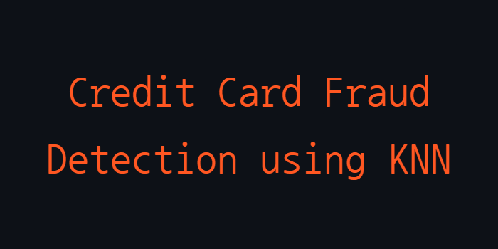

<p align="center">
  
</p>

## Overview
- This project is a machine learning application that uses the K-Nearest Neighbors (KNN) algorithm to detect fraudulent credit card transactions
- Built with Python

<p>This project was developed during my Artificial Intelligence course in college.

## Dataset
The dataset consists of two CSV files:
- **Cartao de credito.csv**: Contains labeled data of credit card transactions, where the target variable is whether the transaction was fraudulent (SIM for fraud, NÃO for non-fraud)
- **Dataset Validacao.csv**: Contains unlabeled data of credit card transactions, which will be classified using the trained model

## Strategy
- **Data Preprocessing**:
<p>Removal of unnecessary columns (e.g., transaction identifier).
<p>Encoding categorical variables (e.g., credit card brand) using one-hot encoding.
<p>Mapping fraud labels from text (SIM, NÃO) to binary values (1 for fraud, 0 for non-fraud).
<p>Converting numeric columns to float after replacing commas with dots in the data.
  
- **Data Splitting**:
<p>The labeled dataset is split into training and testing sets using an 80/20 ratio.
  
- **Data Normalization**:
<p>Features are normalized using MinMaxScaler to improve model performance.
  
- **Model Training**:
<p>The KNN algorithm is used to train the model with the training data.
  
- **Model Evaluation**:
<p>The model's performance is evaluated using accuracy, confusion matrix, and classification report.

- **Prediction on Unlabeled Data**:
<p>The trained model is used to predict fraud on the unlabeled dataset, and the results are saved in a new CSV file.

- The complete report with the solutions can be accessed in this [PDF](pdf/Relatorio.pdf)

## Installation and Usage
To run this project, follow these steps:
1. Install Python
2. Install the dependencies:
   ```bash
   pip install pandas scikit-learn
4. Clone the repository:
   ```bash
   git clone https://github.com/GiuliaFreulon/fraud-detection-knn
   cd fraud-detection-knn
5. Run the program:
   ```bash
   python knn-model.py

## License
This project is licensed under the MIT License. See the [LICENSE](LICENSE) file for details.
